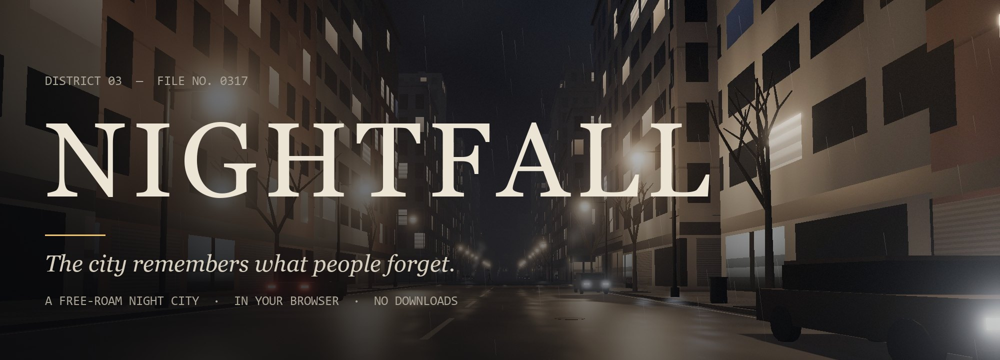
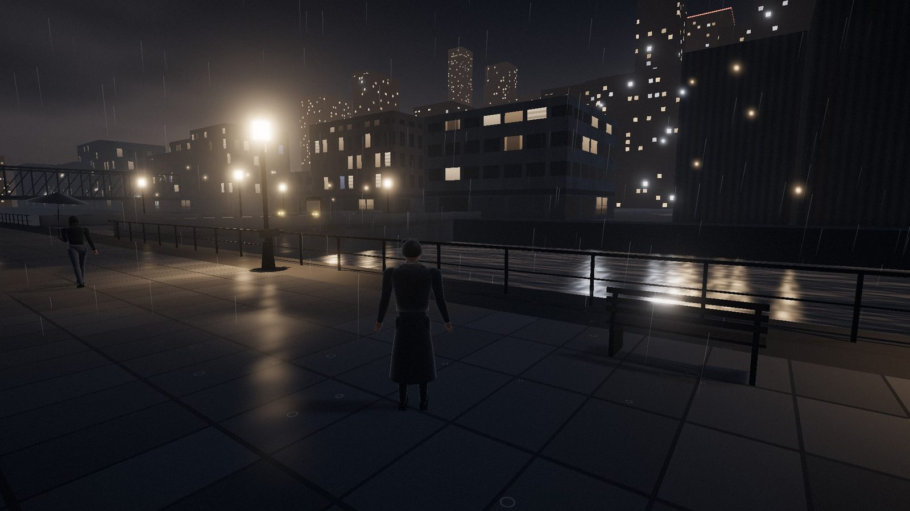
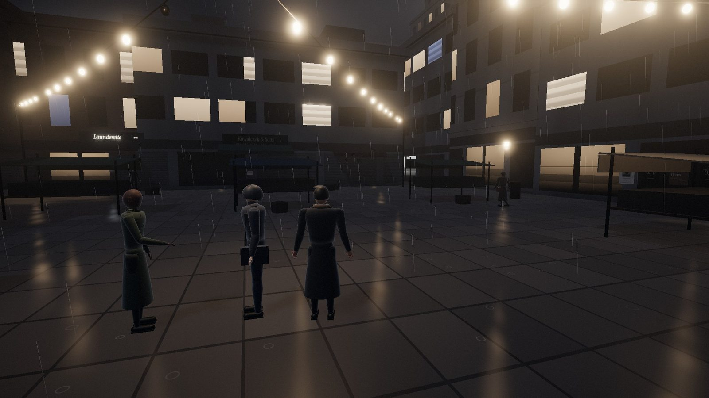
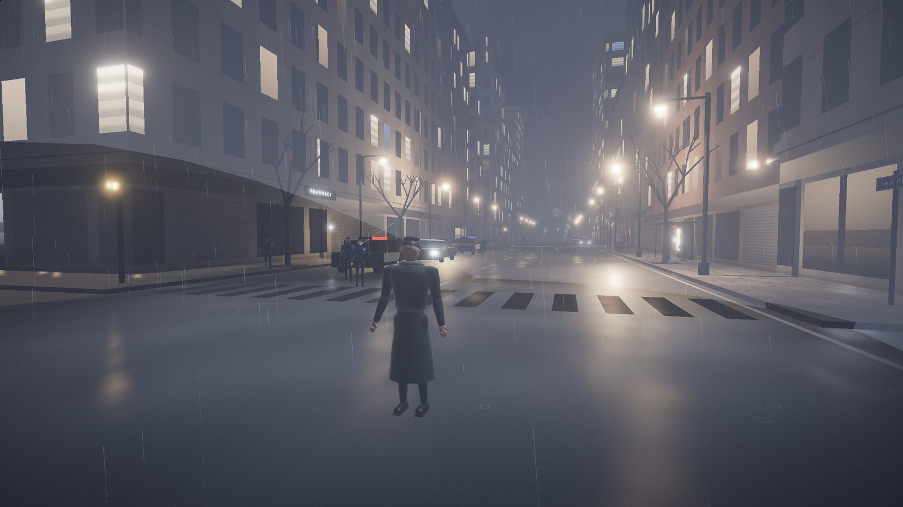
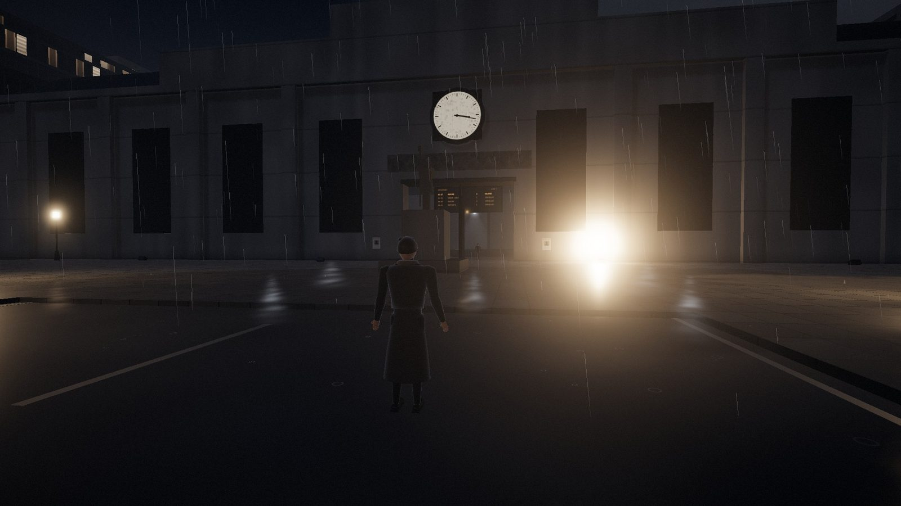
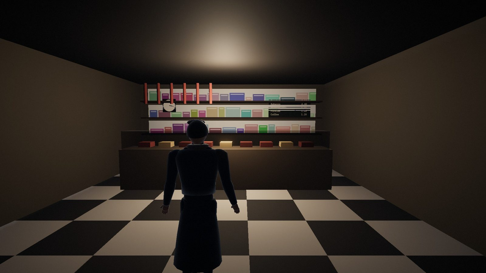
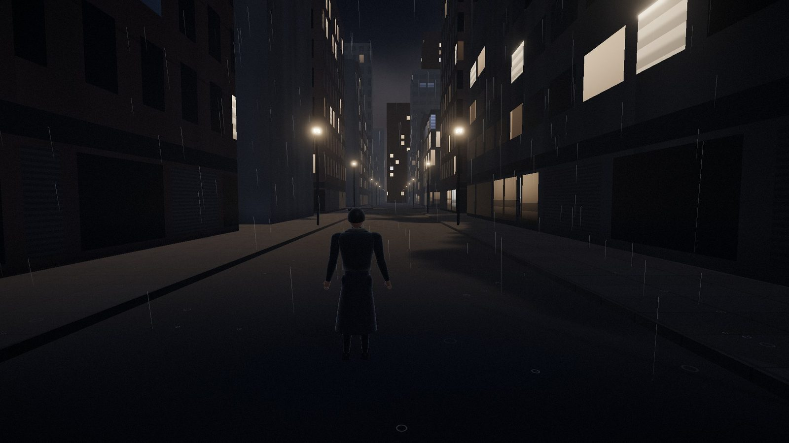
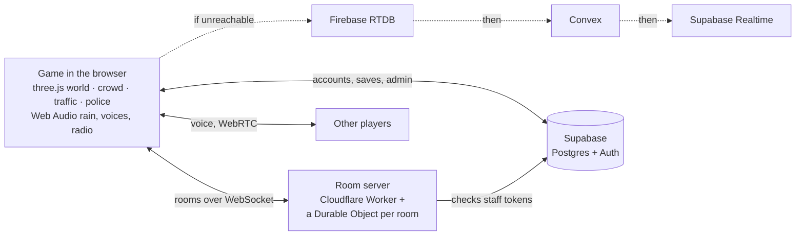

<p align="center">
  <a href="https://nightfall-sand.vercel.app"></a>
</p>

<p align="center">
  <a href="https://nightfall-sand.vercel.app"></a>
</p>

<p align="center">
  
  
  
  
  
  
</p>

**NIGHTFALL** is a rainy, lamp-lit city at 3:17 a.m. that you can walk, drive, sail and fight your way around, alone or with friends, right in the browser. Nothing is downloaded. The buildings, people, textures, rain, radio static and every voice are generated in code when the page opens.

> The station clock has said 03:17 for eighteen years. It is not broken.

<table>
  <tr>
    <td width="50%"><br><sub><b>The Riverside.</b> Wet stone, the river, and the skyline over the water.</sub></td>
    <td width="50%"><br><sub><b>Kestrel Market.</b> People talk under the string lights. Walk up and say something.</sub></td>
  </tr>
  <tr>
    <td><br><sub><b>Two stars.</b> Patrol cars pull up and officers get out. At three, a helicopter holds you in its searchlight.</sub></td>
    <td><br><sub><b>The Old Station.</b> Every train is cancelled except the one that's delayed.</sub></td>
  </tr>
  <tr>
    <td><br><sub><b>Real interiors.</b> A hotel lobby, a launderette, a deli, a pharmacy, a stairwell that never reaches the top, and a holding cell.</sub></td>
    <td><br><sub><b>The Outskirts.</b> Past the edge of the map the streets keep going, forever.</sub></td>
  </tr>
</table>

## Four ways to play one city

Choose how you want the night to go. It's the same world, the same people and the same rain, with different rules.

| Mode | |
|---|---|
| 🏙 **City** | The whole night: drive, explore, take side jobs, get into trouble, run from the police. Every so often, something in the city is not right. |
| 🌙 **After Hours** | No weapons, no police, no clock to beat. Walk, drive with the radio on (or wear it in your headphones), sit by the river, set the rain and hold the hour, and take photographs that go into your Archive. |
| 🎯 **Warzone** | 6 v 6 Domination across the Pier 9 container yard, in **first person** (or over the shoulder). Four loadouts, recoil and spread you can feel, armor, pickups, bots that flank and fall back, a kill feed and a scoreboard. |
| 🥊 **Fight** | One on one where Harbor Lane crosses the avenue, with the traffic held at the lights and a crowd watching. Strings, launchers and juggles, block and parry, throws, a meter for EX specials and breakers, best of three, and a finisher. Play the CPU or a friend on a second controller. |

## What's in it

| | |
|---|---|
| 🌧 **A living night** | A district of seven neighbourhoods, from 03:17 to 05:29 and then around again. Procedural rain you can hear change under an awning, fog, wet reflections, and roughly 200 lamps. |
| 🚶 **People who notice you** | A crowd that walks, waits, smokes, argues and sits by the river. They have their own synthesised voices. They answer when you talk to them, snap at you when you bump into them, and jump out of the way of your car. A few of them are *wrong*. |
| 🚗 **Cars, taxis, boats** | Get into parked cars (the electric ones have a working YouTube dash screen), hail a taxi, and tune into live internet radio. Step down into a launch on the river, or just dive in and swim. |
| 🔫 **GTA-style trouble** | Fists, pistol and SMG. Shooting in the street raises your wanted level, from officers on foot to patrol cars to a helicopter with a searchlight. Muggers and gangs are fair game. You can get busted and do time in a cell, and there's blood if you want it. |
| 🗺 **Things to do** | Side quests that begin with things you find, an Archive that photographs each place the moment you discover it, hidden marks, a payphone that rings for passers-by, and a garden you have to find. |
| 👥 **Together** | Invite anyone with a link. You share the same crowd, traffic and taxi, with text chat, **proximity voice chat**, and PvP. |
| 🧥 **You** | Accounts (email, magic link, Google) or play as a guest, a wardrobe for your look, and saves that follow you between devices. |
| 🛠 **Admin tools** | Fly / noclip, teleport, spawn a car, set the time and weather, blackouts, announcements, kick / ban / jail (checked server-side), live stats, and notes you can leave in the world. |
| 🎮 **Controllers, first class** | Xbox and PlayStation pads with the right button glyphs everywhere, every menu navigable from the couch, an on-screen keyboard, remapping, dead zones and response curves, aim assist on pads only, rumble, a TV-size interface, an emote wheel with quick chat, and joining a friend by room code. |
| 🧍 **People, animated** | Faces, hair, clothes and builds that make each person someone in particular (a courier, a nurse, a taxi driver), an animation system with blending and idle behaviour, 24 emotes, hands on the steering wheel, and reactions to near misses, horns and gunfire. |
| 📱 **Anywhere** | Desktop, phones and tablets (with a thumbstick and touch buttons), all in the browser. |

## Controls

**On a controller** (Xbox names; PlayStation shows its own): left stick move · right stick look · **A** jump · **X** interact / reload · **Y** switch weapon · **B** crouch · **LT** aim · **RT** fire / accelerate · **LB/RB** tabs and pages · **D-pad**: ↑ photo mode (↑ first / third person in Warzone), ↓ emote wheel, ← → radio · **View** map / scores · **Menu** pause. In Fight: **X** light · **Y** heavy (↑ launch, ↓ sweep, → kick) · **LB** block (tap to parry) · **B** dodge · **RB** throw · **RT** special · **A** jump. Everything can be remapped in Settings → Controller.

| Keyboard & mouse | | Touch |
|---|---|---|
| **W A S D** · **Shift** · **Space** | move · run · jump | left thumbstick (push to the edge to run) · Jump |
| **Mouse** (click the game first) | look | drag anywhere |
| **E** | talk · read · open doors · get in and out · board a boat | Use (it shows what it'll do) |
| **Left click** or **F** · **right click** | shoot / punch · aim | Fire · Aim |
| **1 2 3**, **Q** or mouse wheel · **R** | fists / pistol / SMG · reload | Weapon · Reload |
| **H** · **R** · **V** | in a car: horn · radio · dash screen | Horn · Radio · Screen |
| **T** or **Enter** · **N** | chat · microphone on/off | Chat · Mic |
| **M** · **J** · **Esc** | map · archive · pause | top row |
| **`** or **F10** | admin panel (staff accounts) | ⚙ |

## Running it

```bash
npm install
npm run dev          # http://localhost:5317
npm run build        # typecheck + production bundle in dist/
```

The game runs on its own with `localStorage` saves. Everything online is optional and switched on through environment variables (copy `.env.example` to `.env.local`):

| Feature | What to set up |
|---|---|
| Accounts, cloud saves, admin | A Supabase project: `VITE_SUPABASE_URL`, `VITE_SUPABASE_PUBLISHABLE_KEY`, then apply `supabase/migrations/*.sql` |
| Multiplayer rooms, chat, voice, admin kicks | The room server in [`server/`](server): `cd server && npm install && npx wrangler deploy`, then `VITE_ROOM_SERVER` |
| Multiplayer fallbacks | Firebase Realtime Database (`VITE_FIREBASE_*`, rules in [`firebase/`](firebase)) and Convex (`VITE_CONVEX_URL`, functions in [`convex/`](convex)) |

Deploys go to Vercel: `npx vercel deploy --prod`.

## How it's made



A few decisions worth knowing:

- **No assets.** Facades are a single shader, with per-building parameters carried on vertex attributes, so the whole city merges into a few dozen draw calls. Signs, posters and boards are drawn on canvas; people are built from shared part geometries on one instanced rig.
- **Lights are pooled.** Only the nearest few of about 200 lamps get a real light; every lamp still gets a halo, a shaft of rain-lit air and a wet-road streak. The shader's light count never changes, so moving never triggers a shader recompile.
- **Every voice is synthesised.** Formant filters glide between vowels one syllable at a time, and the subtitle tells you what was said.
- **One host simulates the city.** In a shared room the earliest player runs the crowd and traffic and sends snapshots twice a second; everyone else follows with dead reckoning.
- **Admin is checked on the server.** The room server verifies the sender's Supabase token and role before it kicks, bans or broadcasts anything.
- **The outskirts are endless.** 80 m slices are generated around you from a seed and forgotten behind you.

<details>
<summary><b>Project layout</b></summary>

```
src/
  core/        App (state machine + main loop), Input, Settings, SaveState, Cloud
  world/       layout (the city plan), City (build + merge), builders/, Outskirts,
               Collision (grid AABBs), GeoBatch, materials (facade + wet-ground shaders)
  entities/    Humanoid rig, Player, Crowd (+ police, criminals), Traffic, Vehicles,
               Boats, Police (cars + helicopter), Remotes (other players)
  env/ fx/     sky, rain, water, the night's clock; lamp FX, tracers, blood, quest marker
  audio/       procedural rain, voices, radio, the whole mix
  systems/     interaction, discovery, quests, combat
  modes/       rules (one city, four rule sets), Fight + fight/ (frame data, fighters, CPU),
               Warzone + warzone/ (bots, nav grid, guns, first-person viewmodel)
  anim/        pose channels, the animator (layers, blending, masks), clips, idles
  input/       actions, bindings, gamepads, glyphs, haptics
  net/         Multiplayer (transport chain), accounts, voice chat, transports/
  ui/          HUD, menus, map, archive, wardrobe, chat, admin panel, touch controls,
               mode select, controller navigation + on-screen keyboard, emote wheel,
               photo mode, the Fight and Warzone HUDs
  data/        archive entries, lines people say, side quests
server/        the room server (Cloudflare Worker + Durable Objects)
supabase/      database migrations (accounts, saves, admin)
firebase/ convex/   multiplayer fallbacks
```

</details>

More detail on every system, and what to build next, is in [`HANDOFF.md`](HANDOFF.md).
